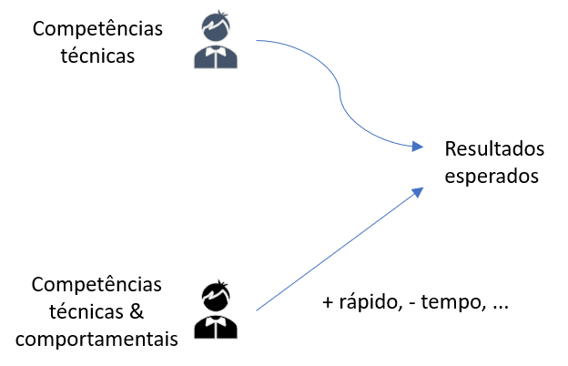
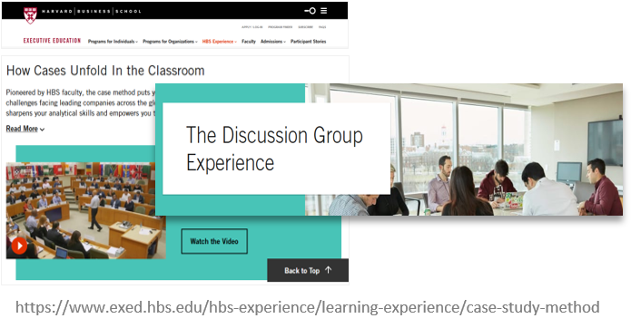
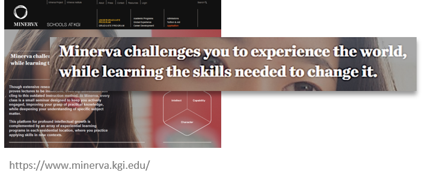
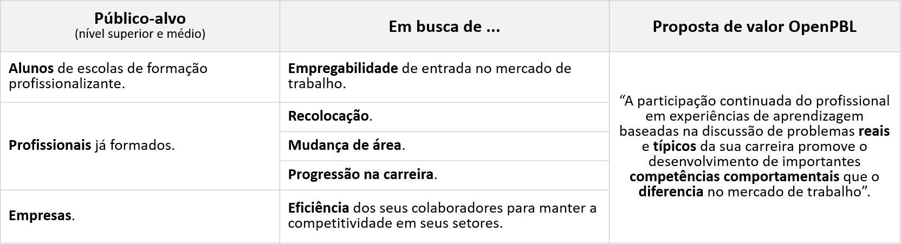

    
    <a href="#english">English</a>
    ·
    <a href="#spanish">Spanish</a>
    ·
    <a href="#portuguese">Portuguese</a>
    ·
    <a href="#chinese">Chinese</a>

 

### OPEN-PBL EXECUTIVE SUMMARY 
Executive summary of the 2020 fundraising Business Plan.  

**THE OPPORTUNITY AND THE PROPOSAL**  
Companies are increasingly demanding professionals from **all hierarchical levels** to develop the **behavioral skills** that allow them, not only to achieve the **expected results** but to achieve them in the **most efficient** way possible.However, despite this growing market opportunity, the offer of educational programs that aim to develop this type of skill does not keep up with the increase in demand.

...

*1. The "Non Disclousure Agreement" for access to the **business plan** is available to investors interested in <a href="http://bit.ly/NDA-OpenPBL">OpenPBL NDA</a>.*

*2. For more details of OpenPBL professional school, see a <a href="https://jorgecataldo.github.io/OpenPBL-Storytelling/#english">storytelling</a> of its standard product (only the portuguese version available).*

 

    
    <a href="#english">English</a>
    ·
    <a href="#spanish">Spanish</a>
    ·
    <a href="#portuguese">Portuguese</a>
    ·
    <a href="#chinese">Chinese</a>

##  
                         
                         

 
 

### RESUMEN EJECUTIVO OPEN-PBL
Resumen ejecutivo del Plan de negocios de recaudación de fondos 2020. 

**...**

(Pronto también disponible en la versión en español)
...

*1. El "Acuerdo de no divulgación" para el acceso al **plan de negocios** está disponible para inversores interesados en <a href="http://bit.ly/NDA-OpenPBL">OpenPBL NDA</a>.*

*2. Para obtener más detalles sobre la escuela profesional OpenPBL, consulte una <a href="https://jorgecataldo.github.io/OpenPBL-Storytelling/#spanish">storytelling</a> de su producto estándar (solo está disponible la versión en portugués).*

 

    
    <a href="#english">English</a>
    ·
    <a href="#spanish">Spanish</a>
    ·
    <a href="#portuguese">Portuguese</a>
    ·
    <a href="#chinese">Chinese</a>

##  
                         
                         

 
 

### OPEN-PBL - SUMÁRIO EXECUTIVO
Resumo da execução do Plano de Negócios para captação de recursos do *road show* 2020.   

**O PROBLEMA E A OPORTUNIDADE**  
Cada vez mais, as empresas vêm demandando de profissionais de **todos os níveis hierárquicos** que desenvolvam as **competências comportamentais** que lhes permitam, não só alcançar os **resultados esperados**, mas alcançá-los da forma **mais eficiente** possível.

Dentre as competências comportamentais **profissionais** mais demandadas, temos: 
- Estruturação de problemas mal definidos; 
- Tomada de decisão envolvendo incertezas, objetivos conflitantes e regras de compliance; 
- Tomada de decisão envolvendo restrições orçamentárias de recursos, restrições éticas e sujeitas à regras de compliance; 
- Atuação sob pressão de prazo, desempenho e opiniões diversas; 
- Atuação em equipe sujeita às dinâmicas de cooperação, competição, liderança e negociação; 
- Visão orçamentária, atitude empreendedora. 

<table style="width:100%">
  <tr>
    <th></th> 
    <th><a href="https://youtu.be/WyKZC7nhQZw">Ver vídeo da entrevista</a></th>
  </tr>
</table>

 

Além da **experiência** ao longo da carreira, as competências comportamentais **profissionais** são desenvolvidas em **programas educacionais** que promovem o exercício **contínuo** de aplicação das competências **técnicas** em **situações reais**, conforme as restrições das **habilidades comportamentais individuais** de cada profissional. 

Entretanto, apesar da crescente procura por **profissionais** e **entrantes** no mercado de trabalho com competências comportamentais já desenvolvidas, a oferta de programas educacionais para esse desenvolvimento **não é suficiente** para suprir o aumento da demanda. 

Este **desequilibrio** pontual do mercado educacional, em conjunto com o surgimento de **novas tecnologias** aplicáveis ao processo educacional, configuram uma excelente **janela de oportunidades** a ser explorada e é o tema principal deste **Plano de Negócios**.  

**PROPOSTA PARA EXPLORAR A OPORTUNIDADE**  
Grande parte do desequilibrio no mercado educacional ocorre porque as escolas que tradicionalmente desenvolvem as **competências comportamentais** de seus alunos operam modelos de negócios que não possuem **economias de escala** suficientes para popularizar seus produtos. 

É o caso das escolas que ofertam programas apoiados por *Problem Based Learning (PBL)*, uma **estratégia de aprendizagem** comprovadamente **eficaz** no desenvolvimento de habilidades comportamentais e, portanto, candidata natural para reduzir este desequilibrio do mercado.   

<table style="width:100%">
  <tr>
    <th></th>
    <th></th> 
  </tr>
</table>

  *Harvard, Minerva e a escola de tecnologia #42 são exemplos bem sucedidos de aplicação da PBL.*

 

Nem mesmo a recente atuação das **Edtechs** no sentido de **popularizar** toda sorte de programas educacionais foi capaz de criar **sistemas de ensino** baseados na PBL que consigam expandir as suas atividades sem custos relevantes.

Os dois principais **obstáculos** à escalabilidade dos modelos baseados em PBL podem ser resumidos em:
- O processo de execução da PBL requer que dois dos mais relevantes **recursos educacionais** em termos de custo (docente e infraestrutura física) sejam **desenvolvidos sob medida** para as instituições de ensino;
- o modelo da **execução 100% digital** das **Edtechs** ainda não resolve o problema da **qualidade da interação síncrona** entre alunos, fundamental para a execução da PBL;

Para dar **escalabilidade à execução da PBL** e, assim, aproveitar a oportunidade gerada pelo desequilíbrio no mercado de capacitação profissional, um time de experientes executivos do setor educacional propõem um modelo de negócios **inovador**, baseado na utilização de **ativos de terceiros** e no **uso intensivo de inteligência artificial**.   

**O TIME**  
Os empreendedores que conceberam e desenvolveram o plano de negócios são profissionais com 20 anos de experiência na condução de unidades de negócios de instituições de ensino superior de **grande porte**, com experiência na comercialização e implantação de **projetos complexos de capacitação corporativa**, isto é, projetos de programas educacionais com: 
- Grande abrangência territorial e diversidade de infraestrutura presencial;
- Grande quantidade e dispersão dos colaboradores envolvidos;
- Integração de diversas estratégias instrucionais (EAD, Presencial,...) num mesmo projeto;  
- Complexidade técnica e inovação das ferramentas tecnológicas envolvidas;
- Grande necessidade de engajamento e fidelização.    

O expertise adquirido é fruto do relacionamento recorrente com grandes empresas e organizações, conforme atestam alguns dos casos:
- PDGs customizados + Complementação para MBAs (*Petróleo Ipiranga*);
- MBA customizados híbridos - Presencial + AVA + Teleconferência; (*Ambev*)
- Projetos de LMS + conteúdo customizado + catálogo de cursos + trilhas por competências + engajamento (*Comitê Olímpico Brasileiro 2020*)
- Universidades corporativas virtuais (*UCB, Nufarm, USPEG...*);  
- Programa de fidelização de PDVs (*Cresça com Aché*);  
- Assessment “agendado” em massa (BDQ) + programa híbrido (*Líderes Cariocas da Prefeitura do Rio de Janeiro*);
- Escolas funcionais inovadoras - TalenTV (*Sambatech*);
- Fábrica Ágil para contact centers (*Atento*)

  

**MODELO DE NEGÓCIOS PARA ESCALAR A PBL**   
Pela PBL, os alunos aprendem **resolvendo problemas** e **refletindo** sobre suas experiências. O processo para execução da PBL pode representado em quatro etapas. 

A essência da proposta é escalar **cada etapa** do processo de execução da PBL de forma **diferente**.  

  

 

**O NEGÓCIO**  
O modelo inovador proposto é a base da criação da Edtech **OpenPBL**, uma **escola profissionalizante de educação continuada** que oferta programas baseados em PBL para **profissionais** e **entrantes** do mercado de trabalho.   

  

 

**DIFERENCIAIS DE MERCADO**  
O modelo de negócios proporciona quatro importantes **atributos diferenciais** aos produtos da escola: 
- Programas desenhados sob medida para **perfis funcionais** típicos do mercado de trabalho, p.ex., analista sênior de marketing e engenheiro de software júnior (diferencial de enquadramento).

- Programas **híbridos** com grande parte do tempo dedicado à **etapa online** assíncrona para adequar-se à **disponibilidade de tempo** dos alunos (diferencial de tempo gasto) ;

- Etapa presencial com várias opções de disponibilidade geográfica para adequar-se às **restrições de deslocamento** do alunos (diferencial de deslocamento e acesso); 

- **Custo baixo** das experiências completas de aprendizagem PBL para caber em **orçamentos de vários tamanhos** (diferencial de custo);
   -- O preço-alvo da **oferta de menor preço** -> R$ 300,00.  

**O PLANO DE NEGÓCIOS**  
As simulações financeiras do modelo de negócios mostram que, com um **investimento inicial** mínimo de R$ 160.000 na **produção de conteúdo**, é possível atingir uma base de 2.500 alunos e **receitas líquidas** de R$ 5 milhões (EBITDA 55% RL) no **quinto ano** de operação da escola. 

Além disto, e o mais importante, após o desenvolvimento de um **sistema educacional proprietário** para operacionalizar e automatizar o modelo, este **desempenho** (*"investimento em conteúdo -> receita no quinto ano"*) poderá ser replicado para garantir uma rápida **expanção das atividades da escola**. 

Para o delineamento detalhado, implantação e testes do **sistema educacional OpenPBL**, são necessários investimentos de R$ 492.000, contabilizados, em grande parte, como "despesa de capital" (capex) em **desenvolvimento de software**.

Além disso, operando com títulos em **português**, **inglês** e **espanhol**.   

**STARTUP DA EMPRESA**  
O startup da escola, previsto para o primeiro ano de operação, tem agendado: 
- Testes com um “concierge MVP” para validar as premissas iniciais de eficácia e custos da execução das sessões presenciais (capital semente);
- Abertura formal da empresa e pré-operação. 
- Desenvolvimento dos sistemas de software (CAPEX); 
- Estudos de mercado e escolha das “escolas funcionais” para oferta inicial na cidade São Paulo;
- Produção do estoque inicial de títulos (CAPEX);
- Lançamento das primeiras trilhas, validação das premissas de mercado e ajustes na campanha.   

**FINANCIAMENTO DO PROJETO**  
Todas as etapas de expansão previstas no plano serão financiadas por **capital de risco** e a principal regra de saída para atrair investidores é a **venda estratégica** da empresa para um grupo educacional.

Ao todo, já foram captados R$ 150.000 à título de capital semente para **validações iniciais** do modelo. 

O objetivo do atual roadshow - publicado em <a href="https://www.crunchbase.com/organization/openpbl#section-overview">CrunchBase.com</a> - é a captação R$ 652.000 em **quatro quotas** de R$ 163.000 para **desenvolver sistemas de software**, **produzir conteúdo** e **capital de giro** para o *startup* da empresa na cidade de São Paulo.

A captação considera o valuation de R$ 5,4 MM;

... 

*1. O "Non Disclousure Agreement" para acesso ao **plano de negócios** está disponível para investidores interessados em <a href="http://bit.ly/NDA-OpenPBL">OpenPBL NDA</a>.*

*2. Para mais detalhes sobre a escola profissionalizante OpenPBL, veja um <a href="https://jorgecataldo.github.io/OpenPBL-Storytelling/#portuguese">storytelling</a> do seu produto-tipo.* 

 

    
    <a href="#english">English</a>
    ·
    <a href="#spanish">Spanish</a>
    ·
    <a href="#portuguese">Portuguese</a>
    ·
    <a href="#chinese">Chinese</a>

##  
                         
                         

 
 

### OPEN-PBL执行摘要
2020年筹款业务计划的执行摘要。 

（很快也有中文版本）

...

*1。 对<a href="http://bit.ly/NDA-OpenPBL"> OpenPBL NDA </a>感兴趣的投资者可以使用“非公开协议”来访问业务计划的“执行摘要”*

*2。 有关OpenPBL专业学校的更多详细信息，请参见其标准产品的<a href="https://jorgecataldo.github.io/OpenPBL-Storytelling/#chinese">讲故事</a>（仅提供葡萄牙语版本）*

 

    
    <a href="#english">English</a>
    ·
    <a href="#spanish">Spanish</a>
    ·
    <a href="#portuguese">Portuguese</a>
    ·
    <a href="#chinese">Chinese</a>

##  
                         

