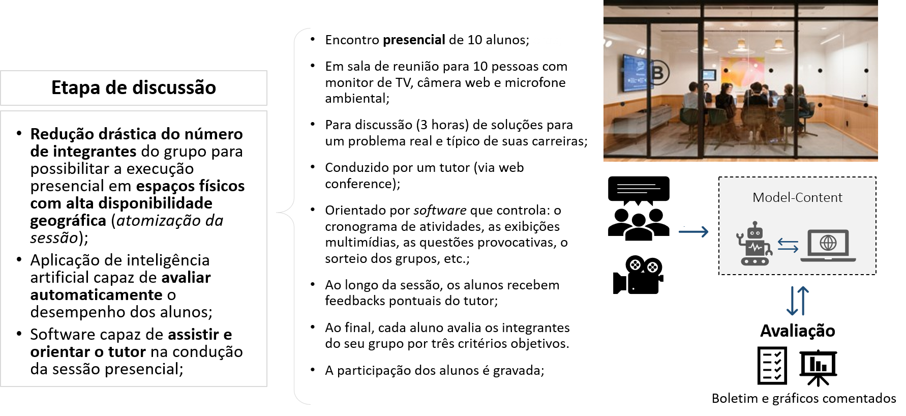

    
    <a href="#english">English</a>
    ·
    <a href="#spanish">Spanish</a>
    ·
    <a href="#portuguese">Portuguese</a>
    ·
    <a href="#chinese">Chinese</a>

 

### OPEN-PBL EXECUTIVE SUMMARY 
Executive summary of the 2020 fundraising Business Plan.  

**THE OPPORTUNITY AND THE PROPOSAL**  
Companies are increasingly demanding professionals from **all hierarchical levels** to develop the **behavioral skills** that allow them, not only to achieve the **expected results** but to achieve them in the **most efficient** way possible.However, despite this growing market opportunity, the offer of educational programs that aim to develop this type of skill does not keep up with the increase in demand.

...

*1. The "Non Disclousure Agreement" for access to the **business plan** is available to investors interested in <a href="http://bit.ly/NDA-OpenPBL">OpenPBL NDA</a>.*

*2. For more details of OpenPBL professional school, see a <a href="https://jorgecataldo.github.io/OpenPBL-Storytelling/#english">storytelling</a> of its standard product (only the portuguese version available).*

 

    
    <a href="#english">English</a>
    ·
    <a href="#spanish">Spanish</a>
    ·
    <a href="#portuguese">Portuguese</a>
    ·
    <a href="#chinese">Chinese</a>

##  
                         
                         

 
 

### RESUMEN EJECUTIVO OPEN-PBL
Resumen ejecutivo del Plan de negocios de recaudación de fondos 2020. 

**...**

(Pronto también disponible en la versión en español)
...

*1. El "Acuerdo de no divulgación" para el acceso al **plan de negocios** está disponible para inversores interesados en <a href="http://bit.ly/NDA-OpenPBL">OpenPBL NDA</a>.*

*2. Para obtener más detalles sobre la escuela profesional OpenPBL, consulte una <a href="https://jorgecataldo.github.io/OpenPBL-Storytelling/#spanish">storytelling</a> de su producto estándar (solo está disponible la versión en portugués).*

 

    
    <a href="#english">English</a>
    ·
    <a href="#spanish">Spanish</a>
    ·
    <a href="#portuguese">Portuguese</a>
    ·
    <a href="#chinese">Chinese</a>

##  
                         
                         

 
 

### OPEN-PBL - SUMÁRIO EXECUTIVO
Resumo da execução do Plano de Negócios para captação de recursos (*road show* 2020.1).   

**O PROBLEMA E A OPORTUNIDADE**  
Um relatório publicado em 2018 pelo Fórum Econômico Mundial elencou as competências profissionais que iriam nortear o mundo do trabalho dali para frente. Segundo o <a href="https://www.weforum.org/agenda/2020/01/davos-2020-future-work-jobs-skills-what-to-know/">relatório</a> que consolida a opinião de gestores de RH de todo o mundo, mais do que as tradicionais competências técnicas, serão as **competências comportamentais** que farão a diferença entre os profissionais num mundo cada vez mais **globalizado**, **dinâmico** e **automatizado**. 

No dia-a-dia, essas competências compõem o arsenal necessário para que os profissionais de diversas áreas, não só alcancem os **resultados esperados** pelas empresas, mas que o façam da forma **mais eficiente** possível. Assim, mais e mais empresas vêm demandando que profissionais de **todos os níveis hierárquicos** desenvolvam competências como "resolução de problemas complexos", "pensamento crítico", "julgamento e tomada de decisão" e "inteligência emocional", dentre outras. 

  

<table style="width:100%">
  <tr>
    <th></th> 
    <th></th>
  </tr>
</table>

<em><a href="https://youtu.be/WyKZC7nhQZw">Vídeo</a> da entrevista com a consultora de RH, Sofia Esteves, sobre competências comportamentais.</em>

  

**Desenvolvendo competências comportamentais**
Competências comportamentais são frequentemente observadas em profissionais **experientes**. A utilização **contínua** das competências **técnicas** nas **situações reais** do dia-a-dia promove naturalmente esse desenvolvimento. Contudo, cada profissional as utiliza com intensidades diferentes, uma vez que são desenvolvidas de acordo com as **habilidades comportamentais individuais** e preferências de cada um.

Além da **experiência profissional**, as competências comportamentais podem ser desenvolvidas em **programas educacionais** específicos, que buscam simular estas situações reais em ambientes controlados com o objetivo de estimular o seu desenvolvimento. É o caso, por exemplo, das escolas que ofertam programas apoiados por *Problem Based Learning (PBL)*, uma **estratégia de aprendizagem** comprovadamente **eficaz** no desenvolvimento de habilidades comportamentais.   

<table style="width:100%">
  <tr>
    <th></th>
    <th></th> 
  </tr>
</table>

<em>Harvard, Minerva e a escola de tecnologia #42 são exemplos bem sucedidos de aplicação da PBL.</em>

 

**Desequilíbrio** 
Apesar da crescente demanda por **profissionais** e **entrantes** no mercado de trabalho com as competências comportamentais elencadas no relatório do Forum econômico Mundial, a oferta de programas educacionais específicos para esse desenvolvimento **não é suficiente** para suprir este aumento da demanda. 

Grande parte deste desequilíbrio no mercado educacional ocorre porque as escolas que tradicionalmente desenvolvem **competências comportamentais** em seus alunos operam modelos de negócios que não possuem **economias de escala** suficientes para popularizar seus cursos. Nem mesmo a recente atuação das **Edtechs** no sentido de **popularizarem** toda sorte de programas educacionais foi capaz de criar **sistemas de ensino** que consigam expandir as suas atividades sem custos relevantes.

Diante deste cenário, os idealizadores do projeto entendem que o **desequilibrio** pontual do mercado configura uma excelente **janela de oportunidades** a ser explorada. 

 

**PROPOSTA PARA EXPLORAR A OPORTUNIDADE**  
A PBL é candidata natural para desenvolver competências comportamentais. Pela PBL, os alunos aprendem **resolvendo problemas** e **refletindo** sobre suas experiências. Contudo, a PBL encontra os seguintes **obstáculos** para uma execução em larga escala:
- O processo de execução da PBL requer que dois dos mais relevantes **recursos educacionais** em termos de custo (docente e infraestrutura física) sejam **desenvolvidos sob medida** para as instituições de ensino;
- o modelo da **execução 100% digital** das **Edtechs** ainda não resolve o problema da **qualidade da interação síncrona** entre alunos, fundamental para a execução da PBL;

Para dar **escalabilidade à execução da PBL** e aproveitar a oportunidade gerada pelo desequilíbrio no mercado de capacitação profissional,  os idealizadores do projeto propõem um modelo de negócios **inovador**, baseado na utilização de **ativos de terceiros** e no **uso intensivo de inteligência artificial**. Diferentemente do paradigma de execução 100% digital, a essência inovadora do modelo proposto está em sua propriedade de escalar **cada etapa** do processo de execução da PBL de forma **diferente**.  

  
  <em>Intervenção em cada uma das etapas do processo de execução da PBL.</em>

   

<b>PRODUÇÃO DE CONTEÚDO AUTOMATIZADA.</b>
  

<em>Sistema especialista para extração de conhecimento dos profissionais experientes.</em>

   

<b>APRENDIZAGEM ADAPTATIVA</b>
  

  
<em>Adaptive learning para acelerar a fase de "self-directed learning".</em>

   

<b>ATOMIZAÇÃO DA DISCUSSÃO</b>
  

<em>Sessão presencial atomizada e assistida por software.</em>

 

  

**O NEGÓCIO**  
Os empreendedores que conceberam e desenvolveram o plano de negócios são profissionais com 20 anos de experiência na condução de unidades de negócios de instituições de ensino superior de **grande porte**. O modelo proposto para escalar a PBL foi utilizado pelos idealizadores como base para a criação da Edtech **OpenPBL**, uma **escola profissionalizante de educação continuada** que oferta programas baseados em PBL para **profissionais** e **entrantes** do mercado de trabalho.  

  

<em>Detalhamento do público-alvo da OpenPBL em função das necessidades.</em>

 

**Produtos**  
**ExperiênciaPBL** é o curso híbrido (semi-presencial), onde o aluno participa de uma experiência de aprendizagem **completa** baseada na discussão de **um problema real** e **típico** da sua carreira.

Na **etapa de Preparação** o aluno recebe: (1) conteúdo descritivo do problema, (2) avaliações de capacitação técnica, (3) material de apoio e (4) curadoria **adaptativa** com recomendações de conteúdo. Na **etapa de discussão** o aluno recebe: (1) infraestrutura física e facilities para a sessão presencial, (2) tutoria da sessão presencial, (3) registro audiovisual da participação e (4) *feedback* do desempenho;  

**Benefícios ao público alvo** 
A **participação continuada** do profissional nas **ExperiênciasPBL** promove um **ganho** no seu patamar de empregabilidade que o **diferencia** no mercado de trabalho. Esse ganho de empregabilidade é conseguido com o desenvolvimento das seguintes competências comportamentais profissionais:
- A estruturação de problemas mal definidos; 
- A tomada de decisão envolvendo incertezas, objetivos conflitantes e regras de compliance; 
- A tomada de decisão envolvendo restrições orçamentárias de recursos, restrições éticas e sujeitas à regras de compliance; 
- A atuação sob pressão de prazo, desempenho e opiniões diversas; 
- a atuação em equipe sujeita às dinâmicas de cooperação, competição, liderança e negociação; 
- A visão orçamentária, atitude empreendedora.  

**Ofertas**  
Os produtos são adquiridos via oferta **avulsa** da ExperiênciaPBL pelo preço alvo médio de R$ 320,00 ou de **trilhas** de ExperiênciasPBL, “curadas” para promover a **capacitação funcional** de profissionais (**Trilhas de Carreira**);

*As trilhas de carreira para **setores específicos** também podem ser ofertadas, embora devam ser decididas de acordo com a viabilidade logística de cada região.*  

**Diferenciais**  
- **Custo**. Custo baixo das experiências completas de aprendizagem PBL para caber em orçamentos de vários tamanhos.
- **Tempo síncrono**. Programas híbridos com grande parte do tempo dedicado à etapa online assíncrona para adequar-se à disponibilidade de tempo dos alunos.
- **Deslocamento e acesso**. Etapa presencial com muitas opções de disponibilidade geográfica para adequar-se às restrições de deslocamento do alunos.
- **Eficácia**. Programas funcionais **setoriais** (trilhas de carreira) aumentam **ainda mais** a diferenciação e, consequentemente, o ganho de empregabilidade promovido pela PBL.   

**Comercialização B2C e B2B**  
A política de **canais B2C** é baseada em parcerias com empresas ativadoras de tráfego e conversão do público-alvo:
- Marketplaces digitais: (1) generalistas (Amazon, ...); (2) foco educacional (Udemy, ...);
- Escolas profissionalizantes: (1) ensino médio; (2) instituições de ensino superior - IES;
- Agências recrutadoras: (1) generalistas; (2) especialistas; 

A Política de **canais B2B** é baseada em parcerias com associações profissionais, cooperativa empresas de representação comercial e organizações diversas.

 

**O PLANO DE NEGÓCIOS**  
Simulações financeiras do modelo de negócios mostram que, com um **investimento inicial** mínimo de R$ 160.000 na **produção de conteúdo**, é possível atingir uma base de 2.500 alunos e **receitas líquidas** de R$ 5 milhões (EBITDA 55% RL) no **quinto ano** de operação da escola. 

As simulações das vendas consideraram as seguintes premissas:

**Premissas de captação no ano 2**
- Preço da oferta de trilha com 8 SessõesPBL - R$ 2.560 por aluno;
- % da ROB destinada à captação (atração e conversão) - 15% ROB
- % da captação alocado para atração - 70% 
- Leads (SAL*) gerados no ano - 3.466
- Taxa de conversão (VENDAS/SAL) - 10,0%
- Produtos vendidos no ano – 347 trilhas;
- Custo de atração (por SAL) - R$ 27,15
- Custo de conversão (por venda) - R$ 116,37
- Nr de alunos capacitados ao longo do ano 2 – 347 (sem recorrência); 
- Sessões presenciais executadas no ano 2 – 35 sessões (2,9 por mês). 

**Premissas de crescimento ano 1-5** 
- Crescimento das vendas (ano 2-1) - 80,0%
- Crescimento das vendas (ano 3-2) - 100,0%
- Crescimento das vendas (ano 4-3) - 100,0%
- Crescimento das vendas (ano 5-4) - 80,0%
- Preço médio das ofertas - R$ 2.206   

  

<em>Detalhamento do desempenho comercial de acordo com as premissas de captação e crescimento.</em>

  
As simulações do DRE consideraram as seguintes premissas:

**Premissas de custos e preços no ano 2**
- Custo direto total da SessãoPBL - R$ 701
- Custo com conteúdo - R$ 60 
- Custo com locação da sala - R$ 458 (3 horas x R$ 152)
- Custo com o tutor - R$ 183 (4 horas x R$ 45)
- Custo do serviço de vídeo – R$ 
- Impostos sobre serviços educacionais – 8,65%
- Margem-alvo de contribuição aos custos indiretos - 55%
- Taxa de no show esperada - 10%
- Preço sugerido para a oferta avulsa da SessãoPBL - R$ 323 por aluno.  

  

<em>Demostrativo de resultados, geração de caixa livre e balaço patrimonial.</em>

  

**EXPANSÃO**  
Após o desenvolvimento de um **sistema educacional** para automatizar o modelo, o **desempenho** simulado acima (*"investimento em conteúdo -> receita no quinto ano"*) poderá ser replicado para garantir uma rápida **expansão das atividades da escola**. 

Para o delineamento, implantação e testes do **sistema educacional** são necessários investimentos de R$ 492.000, contabilizados, em grande parte, como "despesa de capital" (capex) em **desenvolvimento de software**.

Os sete componentes do software que compõe o sistema educacional são: 
- Expert system para parametrizar as relações causais entre um problema proposto pelo especialista e as competências superiores que propõe desenvolver;
- *Machine learning model* capaz de produzir automaticamente os cenários de problemas com títulos em **português**, **inglês** e **espanhol**.
- *Adaptive learning system* para acelerar a etapa de SDL dos alunos.
- *Recommender system* para recomendação do conteúdo de apoio na etapa de SDL dos alunos.
- *Software system* para assistir e orientar o tutor da sessão presencial.
- *Machine learning model* capaz de avaliar automaticamente o desempenho dos alunos.
- *API* para integração com bases de dados de recrutamento profissional.  

**STARTUP**  
O startup da escola, previsto para o **primeiro ano** de operação, tem agendado: 
- Testes com um “concierge MVP” para validar as premissas iniciais de eficácia e custos da execução das sessões presenciais (capital semente);
- Abertura formal da empresa e pré-operação. 
- Desenvolvimento dos sistemas de software (CAPEX); 
- Estudos de mercado e **escolha das “escolas funcionais”** para oferta inicial na cidade São Paulo;
- Produção do estoque inicial de títulos (CAPEX);
- Lançamento das primeiras trilhas, validação das premissas de mercado e ajustes na campanha.   

**FINANCIAMENTO DO PROJETO**  
Todas as etapas de expansão previstas no plano serão financiadas por **capital de risco** e a principal regra de saída para atrair investidores é a **venda estratégica** da empresa para um grupo educacional.

Ao todo, já foram captados R$ 150.000 à título de **capital semente** para **validações iniciais** do modelo. 

O objetivo do atual roadshow - publicado em <a href="https://www.crunchbase.com/organization/openpbl#section-overview">CrunchBase.com</a> - é a captação de R$ 652.000 (**quatro quotas** de R$ 163.000) para **desenvolver sistemas de software**, **produzir conteúdo** e para **capital de giro** durante o *startup* da empresa na cidade de São Paulo.

A captação considera o *valuation* de R$ 5,4 milhões;

... 

*1. O "Non Disclousure Agreement" para acesso ao **plano de negócios** está disponível para investidores interessados em <a href="http://bit.ly/NDA-OpenPBL">OpenPBL NDA</a>.*

*2. Para mais detalhes sobre a escola profissionalizante OpenPBL, veja um <a href="https://jorgecataldo.github.io/OpenPBL-Storytelling/#portuguese">storytelling</a> do seu produto-tipo.* 

 

    
    <a href="#english">English</a>
    ·
    <a href="#spanish">Spanish</a>
    ·
    <a href="#portuguese">Portuguese</a>
    ·
    <a href="#chinese">Chinese</a>

##  
                         
                         

 
 

### OPEN-PBL执行摘要
2020年筹款业务计划的执行摘要。 

（很快也有中文版本）

...

*1。 对<a href="http://bit.ly/NDA-OpenPBL"> OpenPBL NDA </a>感兴趣的投资者可以使用“非公开协议”来访问业务计划的“执行摘要”*

*2。 有关OpenPBL专业学校的更多详细信息，请参见其标准产品的<a href="https://jorgecataldo.github.io/OpenPBL-Storytelling/#chinese">讲故事</a>（仅提供葡萄牙语版本）*

 

    
    <a href="#english">English</a>
    ·
    <a href="#spanish">Spanish</a>
    ·
    <a href="#portuguese">Portuguese</a>
    ·
    <a href="#chinese">Chinese</a>

##  
                         

